# Strangereal1.github.io

## How to use

### Scan the qrcode below and open a website automatically.  

  

### On the home page you will see the twelve constellations.

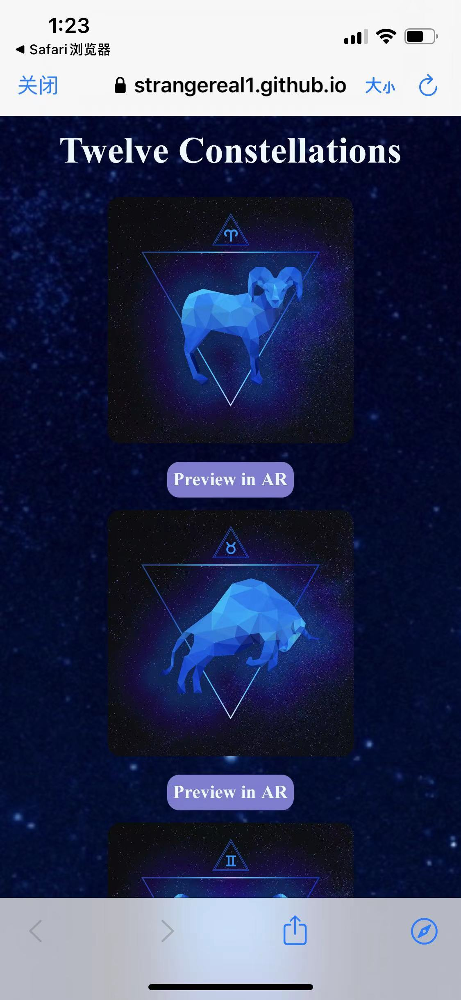 

### Use your phone's camera scan the pictures below.  

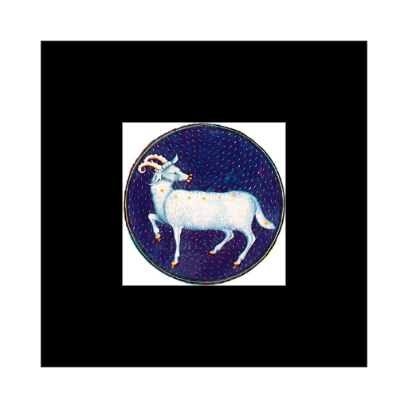  
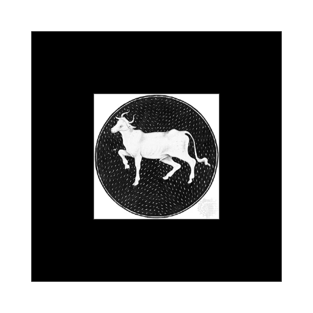 

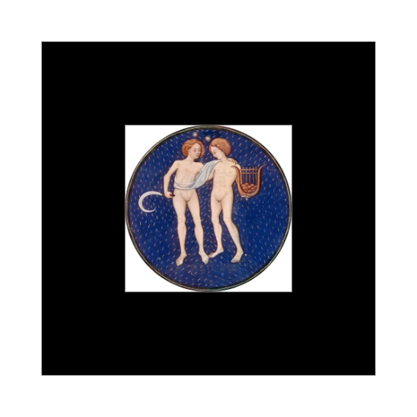  
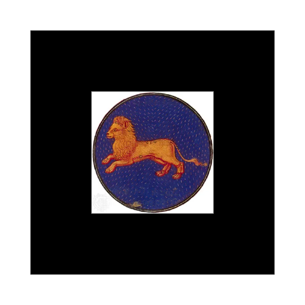 

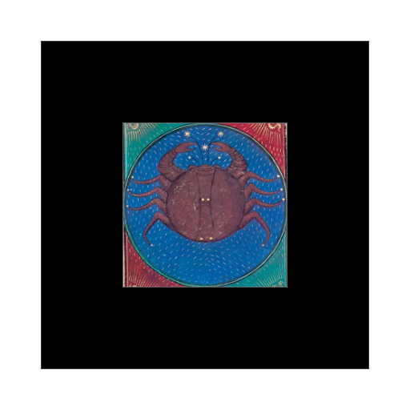  
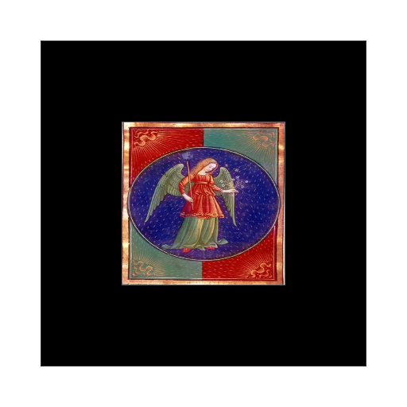 

  
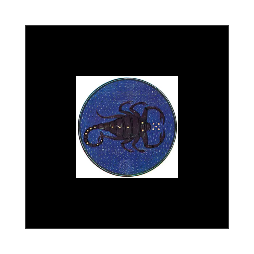 

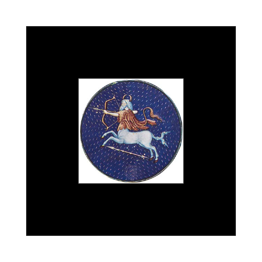  
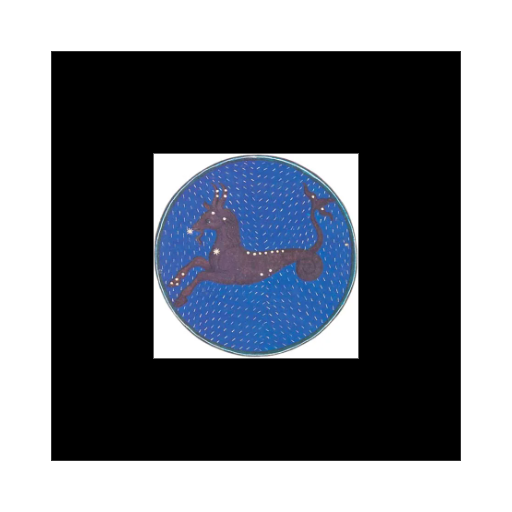 

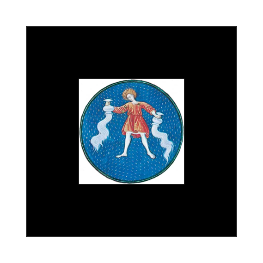  
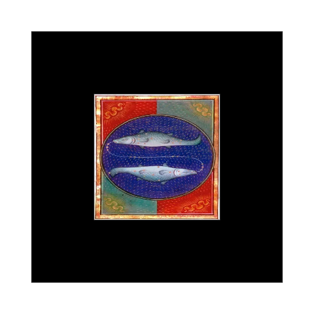 

###  Find some 3D models.  

